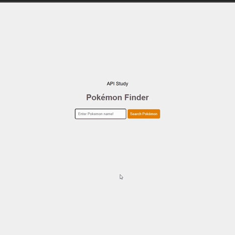

<section>

# ⚡ Pokémon Finder

# About the project

Build a web app that fetches and displays Pokémon data from a public API (https://pokeapi.co/).

## 🎯 Objectives:

Learn how to consume APIs using JavaScript.

Understand how to work with JSON data from external sources.

Practice DOM manipulation, event handling, and error handling.

Build a simple but interactive UI that responds to user input.

## 🧩 Features and Requirements:

Use HTML for structure, CSS for styling, and JavaScript for logic.

Allow users to enter a Pokémon name or ID into a search bar.

Trigger a search with a button click or "Enter" key press.

Show Pokémon Sprite.

Display a user-friendly message if input is invalid.

</section>
